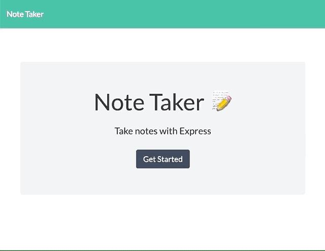

# note-taker
## An application that can be used to write, save, and delete notes. This application uses an express backend to save and retrieve note data from a JSON file.

### Description
A simple, easy to use application for users to write, save, and delete notes.

### Installation
The code for this application can be accessed here:
[GitHub Repository](https://github.com/stephmarie17/note-taker)

The deployed application can be accessed here:
[Deployed Site]()

### Usage
To use the app, navigate to the /notes page. Add a note by filling in the title and text, then clicking the dynamically rendered save button. To view the note, click on the title that displays on the left-hand sidebar. Click the delete icon to delete a note.

